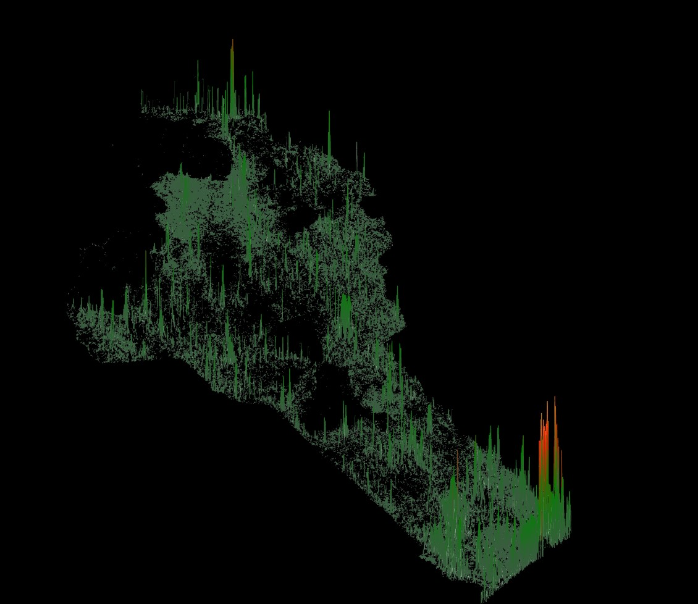

# Benin Population Spike Map

This project creates a **3D population density “spike” map of Benin** using openly available data from the [Kontur Population dataset](https://data.humdata.org/dataset/kontur-population-dataset).\
It uses R and the [`rayshader`](https://www.rayshader.com/) package to render a high-quality 3D visualization of population density.



------------------------------------------------------------------------

## Features

-   Automated download of the latest Kontur Population dataset for Benin.
-   Handles `.gz` extraction automatically and skips re-downloading if files already exist.
-   Uses **tidyverse**, **sf**, **stars**, and **rayshader** to:
    -   Load population raster data,
    -   Convert it to a matrix,
    -   Render a 3D spike map.
-   Outputs a high-resolution PNG ready for sharing.

------------------------------------------------------------------------

## Requirements

-   R ≥ 4.3
-   The following R packages:
    -   `tidyverse`
    -   `R.utils`
    -   `httr`
    -   `sf`
    -   `stars`
    -   `rayshader`

------------------------------------------------------------------------

## How to Run

1.  Clone this repository:

    ```` ```bash ````

    `git clone https://github.com/YOURUSERNAME/benin-spike-map.git`

    `cd benin-spike-map`

2.  Open benin-spike-map.R in RStudio or any R IDE

3.  Run the whole script:

`source("benin-spike-map.R")`

## Acknowledgements

This project is heavily inspired by and adapted from the work of the original author Milos Popovic. Watch the excellent tutorial here: 📺 [YouTube Video Tutorial](https://youtu.be/qTDf5VVnjMM?si=ka6BLRAHzuQi7dEc)

Please check out and support their work!

## License

This repository is shared under the same license as the original author’s code where applicable. All underlying population data © [Kontur.io](https://www.kontur.io/) under their respective terms.
